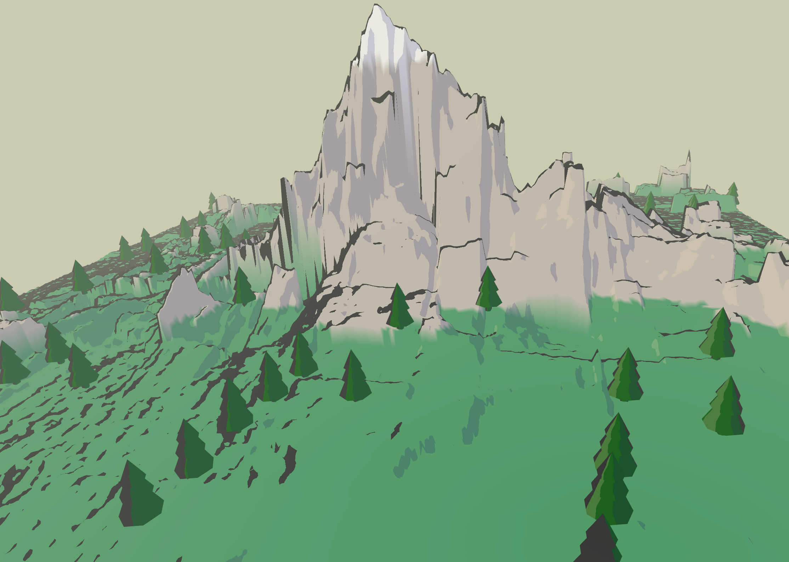

# Cartoon World
 
### Introduction to Computer Graphics, Fall 2021, Final Project
### Created by Kevin Hsu (khsu13), Mandy He (mhe26), Mehek Jethani (mjethani)
#### [Link to demo](https://youtu.be/9O_QzsNyzRM)
 

 
## Description / Theme
- A stylized cartoon scenary that contains a generated terrain. The user can move around the scene using the key controls.
 
## Technical features
- Stylized rendering
- Terrain generation
- Different biomes based on altitude
- Random tree generation
- Basic camera movement
 
## Usage
- Toggle the time of the day using the `Time` slider (affects shading and color)
- Select terrain type (lab, lake, cliff) from the radio buttons
- Select tree spawn rate by using the `Trees` slider
- Toggle outline with the checkbox, and `Outline weight` with the slider
- Use arrow keys to rotate camera, WASD to move around, Space and C to move up and down
 
## Design Decisions
We integrated our Terrain lab code with our project code and created a new scene in the Scenegraph folder called TerrainScene. 
 
We also made a subfolder in Shapes called Terrain and made separate files for each Terrain Type and our BasicTree which is made up of primitives from shapes. Depending on which terrain type. The lab terrain is essentially a modified version of the lab2/terrain lab code. The lake terrain uses a more complicated noise function with height that’s altered by the distance from the center. Our cliff terrain uses Fractional Brownian Motion to generate the rocky structure of the terrain. 
 
Depending on the tree rate selected by the user in the UI, trees are generated pseudo-randomly throughout the terrain. We’ve also adjusted the generation to ensure that the trees only generate on a certain range of altitudes (aka. trees are ensured not to appear in the blue/water areas of terrains). For efficiency, rather than recalculating the locations for the trees each time the tree rate is adjusted, the locations of the trees are calculated once when the terrain type changes and accessed every time the tree rate is adjusted.
 
The terrain vertex shader accepts an input color for regular shapes, but can be set to color terrain which then causes it to set the vertex color based on the y value of the world space position (ie the altitude) allowing us to create different “materials” in the terrain. Doing this in the vertex shader causes it to have a more gradual and uneven transition between layers instead of a solid line.

The fragment shader handles the toon shading and outlines as well as adding a slight fade into the background color for things that are farther away from the camera. The toon shading uses a simplified lighting model that just calculates the luminosity of the fragment based on the normal and light vectors and then based on the interval of the value, either leaves it as the base color or tints it to be a highlight or shadow. Changing the “time” alters the lighting angle to imitate the sun’s movement and changes the background color, tinting everything and giving the impression that the lighting color changes without having to modify the lighting calculation.

## Known bugs
None
